# Goals
*   Cost less than a cheap commercial 2-bay NAS (~$200)
*   Low power
*   NAS for local file sharing
*   A limited router to segregate scary "smart" devices on the LAN
*   Maybe run some IoT things

# Parts

| Quantity | Part | Cost|
| --------: | ---- | --- |
| 1× | [Banana Pi BPI-R2][bpi-r2] | $89 (Aliexpress) |
| 1× | [Athena Power BP-SAC2131B 3.5" HDD Hot-Swap Backplane][backplane] | $20 (Newegg sale) |
| 1× | Laser cut acrylic panel | $20, some scrap acrylic included |
| 1× |Jentec JTA0512 Power Supply | $15 (eBay used) |
| 1× | [SATA power splitter cable][SATA power splitter] | $5 |
| 2× | [Thin SATA Cables][thin sata cables] | $4 total |
| 1× | Acrylic cement | |
| 4× | Motherboard standoffs and screws | |
| 4× | Adhesive rubber feet | |
| 2× | WD Easystore 8TB External Hard Drive | $260 ($130 each, 2017 black friday) |
| | *Approximate total excluding hard drives and shipping* | *$153* |


# Enclosure

The enclosure is an [Athena Power BP-SAC2131B 3.5" HDD Hot-Swap Backplane][backplane]. This is a a 3-bay hot swap backplane intended to go into two 5.25" bays of a server. This is not a trayless backplane, the hard disks must be mounted using four included screws.

This is a 3-bay case, but I only need the top two bays for hard drives. In the bottom bay I will put the computer that runs the NAS. Something like a Pico-ITX or 3.5" SBC computer will fit within the footprint of a hard dive.

The main problem with using an internal enclosure as a case is that all the SATA connections ago out the back of the case, not internally for connection to a computer.

Luckily there is a slot on the back of the case. Using something like these [very thin blue SATA cables][thin sata cables] I can connect an internal computer to the back of the case.

<figure>
<figcaption>Connect the cables by running them out the side...</figcaption>

<a href="images/nas-side-open.jpg">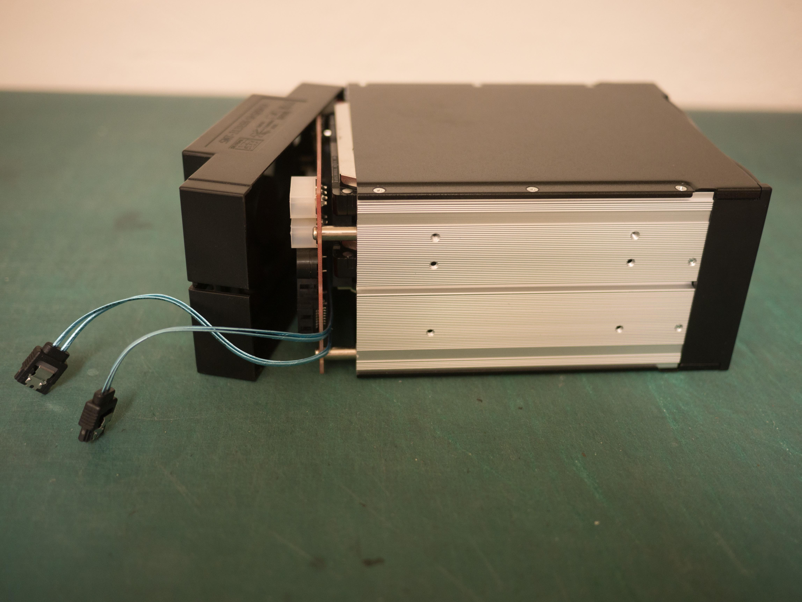</a>
</figure>

<figure>
<figcaption>...and plugging them into the back</figcaption>
<a href="images/nas-back.jpg">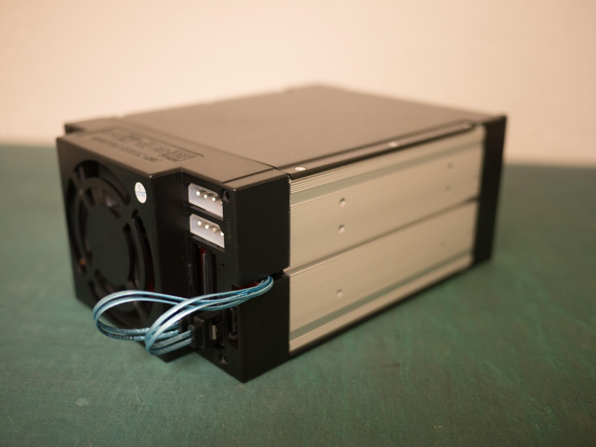</a>
</figure>


Yes, this looks a little crazy. But whatever.

# Silence the fan

The enclosure's included fan is very loud. Which is understandable considering it was intended for server environments.

<!-- TODO: fan size -->
I considered replacing it with a quiet computer fan, but it uses a nonstandard fan size: ???x???mm. Also, while it's just a voltage controlled fan, it doesn't use the standard 3-pin CPU fan connector.

Disconnecting the fan is difficult because a buzzer alarm sounds when the enclosure detects 0 RPM on the fan. The alarm may be silenced by pressing the "reset" button, but it will sound each time the NAS is power cycled. However, it appears two pins on the back of the case are connected to the front reset button, so you can simply put a jumper across them to permanently silence the buzzer.

The bigger problem is that HDDs actually get hot. Not much, but they do require some cooling. With the fan disconnected the disks quickly got up to 45°C and kept climbing towards 50°C.

There is a "HIGH–LOW" switch on the back of the enclosure to slow the fan down, but it doesn't significantly reduce the fan noise. Measuring with a voltmeter, it switches the input of the fan from 12V to ~9V.

Instead I connected the fan's power directly to the 5V line. Do note that this doesn't work with all computer fans, not all will start with significantly reduced voltage. It seemed to work fine with this specific fan though. Supposedly, another option is to to run the fan at 7V by leaving the fan connected to 12V and connecting it's ground pin to the 5V line, but I didn't try it.

With the fan running very slowly at 5V, the HDD temperatures measured with SMART stay at a steady 44°C which I decided was acceptable.

Following traces by eye and verifying with a multimeter I found a 5V pin on the right side of the board to run the fan from. I clipped the center power pin from the fan connector and removed it completely so I could run a new wire into the connector through the old hole.

<figure>
<a href="images/nas-fan-power.jpg">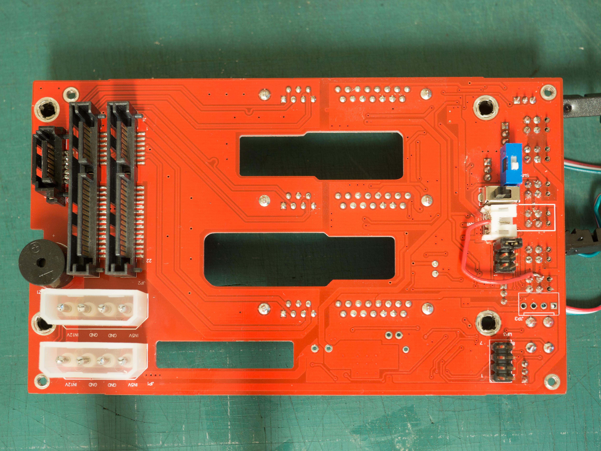</a>
</figure>

Yes, this looks kind of terrible. Whatever.

# Power

Because the case is an intended to be mounted inside a computer, it takes either Molex or SATA power as input. There are two of each power connector, but only one needs to be connected.

The BPI-R2 board I used claims to require 12V 2A, but it does not appear to ever pull close to 2A. Each hard disk is marked "5V 400mA, 12V 550mA". I decided to look for a combination 5V 3A + 12V 3A power supply. I bought a used Jentec JTA0512 power supply off eBay. This power supply came with a 6 pin connector providing both 12V and 5V.

To connect the power supply, I reterminated it with a modular SATA power connector. The easiest way to get these connectors without scavenging them seems to be from a [SATA power splitter][[SATA power splitter]. The back of each connector can be popped off. Inside they are punch down blades that cut through the cables' insulation to make connection.

<figure>
<figcaption>Remove one of the male SATA connectors and chop off the PSU's plug</figcaption>
<a href="images/nas-sata-and-power-cables.jpg">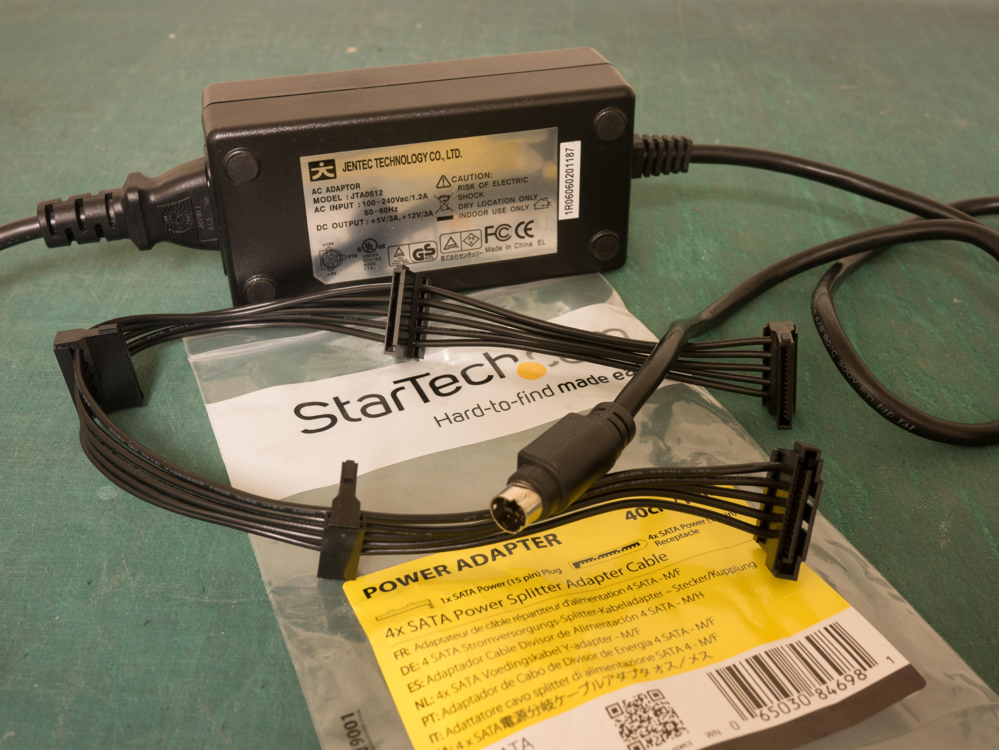</a>
</figure>

<figure>
<figcaption>With the back of the SATA connector new cables can be connected</figcaption>
<a href="images/nas-terminating-power-cable.jpg">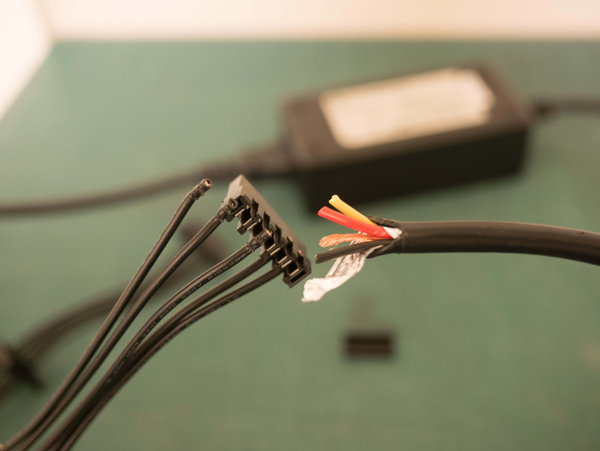</a>
</figure>


<figure>
<figcaption>Connect all the wires... somehow</figcaption>
<a href="images/nas-finished-power-cable.jpg">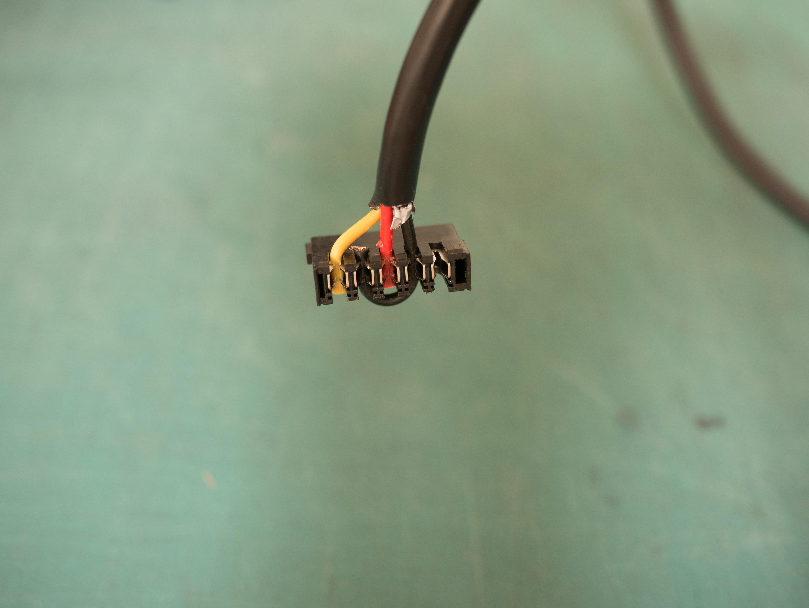</a>
</figure>

Connecting both ground pins in the SATA power connector is probably unnecessary because all the ground pins are connected in the backplane. It also makes it impossible to put the cover back on the connector.

# SBC

Because no standard PC motherboard will fit in this enclosure, we are in the realm of single board computers (SBC). However, there are very few boards that have SATA support. And of the few that do have SATA, very _very_ few have more than one SATA port.

<!-- TODO: Ethernet bandwidth -->
I selected the [Banana Pi BPI-R2][bpi-r2] because it had two SATA connectors and gigabit Ethernet. As a bonus, it actually has a total of 5 GbE ports that share ???Gb of bandwidth, this is nice if I want some router functionality also. This board connects the SATA ports to the SoC via a ASM1061 SATA controller connected via PCIe. Most cheaper boards actually connect their SATA ports via USB, so this should be a good choice.

<!-- TODO: other SATA boards -->
> Since I started this project a few other boards with multiple SATA have become available. The BPI-R2 is still one of the cheapest with 2 SATA ports though.

One problem with this board is it requires manually powering it on by holding the power button. It does not automatically power on when connected to power. Let's fix that by [shorting the  pins on the power button][power pins forum].

<figure>
<figcaption>Enable auto power on by shorting PIN1 and PIN2 of RST</figcaption>
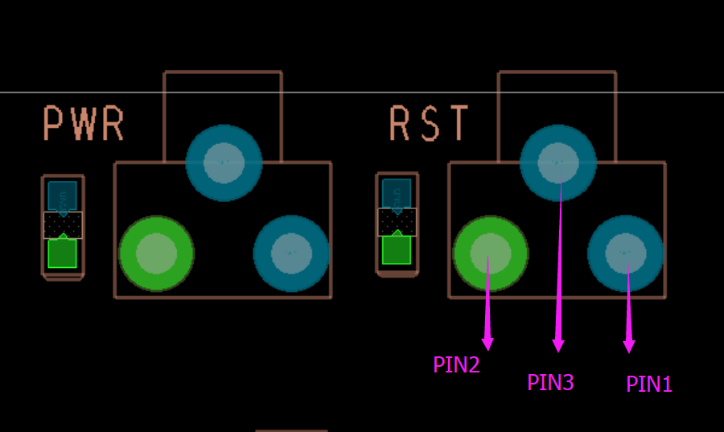
</figure>


<figure>
<figcaption>PIN1 and PIN2 bridged</figcaption>
<a href="images/nas-bridged-rst.jpg">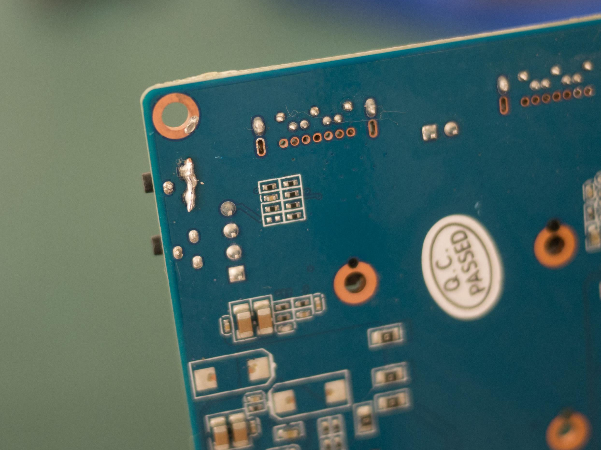</a>
</figure>

A minor issue is that recent kernel versions actually shutdown when the reset button is pressed when the system is running. That can be fixed by [disabling the power button kernel module][power pins issue].

```
$ echo "blacklist mtk_pmic_keys" >/etc/modules-load.d/mtk_pmic_keys.conf
```

The second issue is that I want to power the board from the enclosure's SATA backplane. The backplane's SATA power connector's can provide the required 12V, but there is no way to power the BPI-R2 except for it's barrel connector. (There is a battery connector, but [apparently it is useless][battery connector].)

Instead, I decided to solder a wire directly to the pins of the barrel connector. While desoldering it I discovered there are holes in the pins. This made it easy to just loop the wire through the pins and resolder them.

<figure>
<figcaption>Power connected to barrel connector pins</figcaption>
<a href="images/nas-barrel-connector-unsoldered.jpg">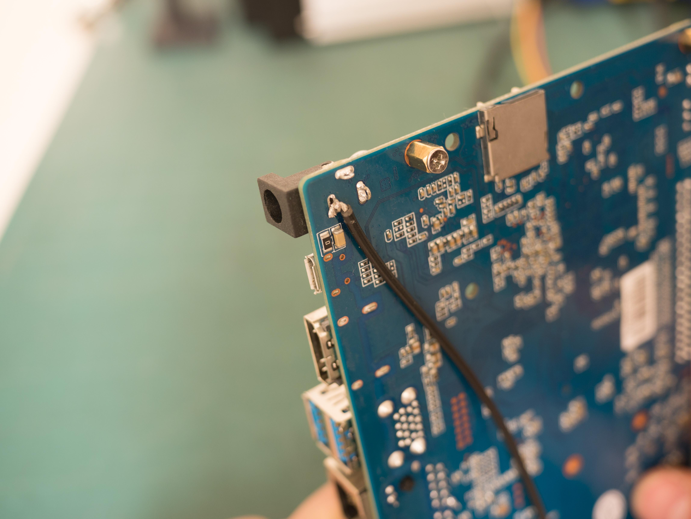</a>
</figure>

Connect the power wires to a male modular SATA power connector. I had to snap the edges off of the connector to allow it to fit beside a SATA data connector on the backplane.

<figure>
<figcaption>Male SATA power connector with snapped off edges</figcaption>
<a href="images/nas-board-sata-power.jpg">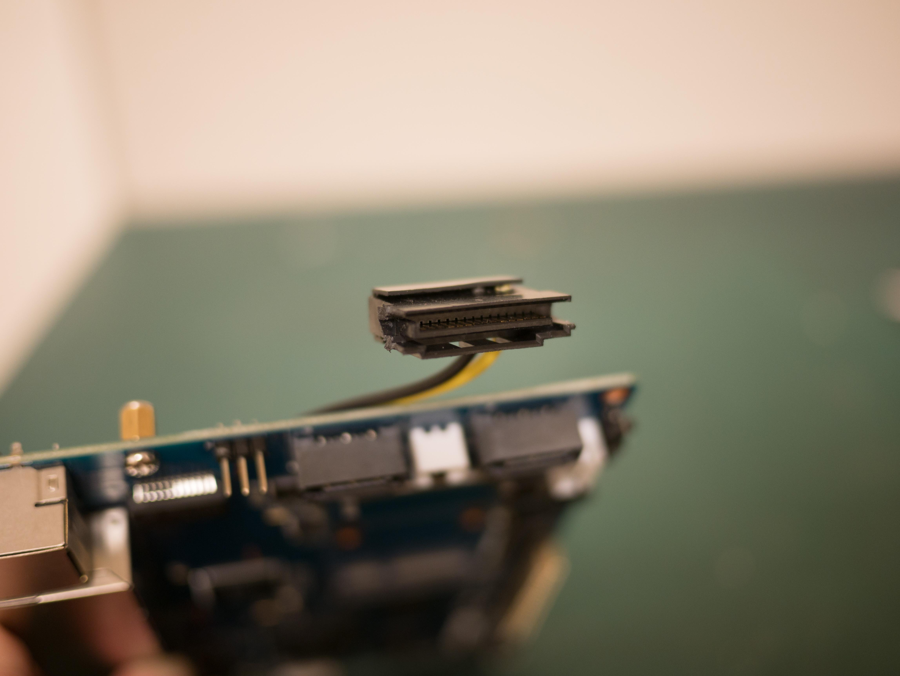</a>
</figure>

Connect the board to the bottom SATA port. It all barely fits in the case.

# Initial test

At this point the board can be connected to the backplane and tested. I also installed some hard drives for testing.

<figure>
<figcaption>It's alive!</figcaption>
<a href="images/nas-testing-side-open.jpg"></a>
</figure>

<figure>
<a href="images/nas-testing-front.jpg"></a>
</figure>

# Acrylic side panel

Now I had to figure out a way to cut holes for all the I/O ports in the side of the enclosure. I suppose I could have CNC cut the aluminum... or 3D printed a side panel. Instead I decided to get a piece of acrylic laser cut for the side panel. (And I'm pretty sure It's a law that all custom computer cases have to have a window, so it's good for that too.)

To get near perfect measurements of the original side panel and the I/O ports, I just put them on a flatbed scanner. I also included a ruler while scanning, but the scale was already perfect.

<figure>
<a href="images/scanned.pdf">
<figcaption>Scanned original side panel and I/O ports [PDF]</figcaption>
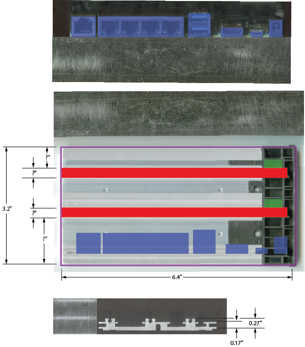
</a>
</figure>

Then I simply outlined the original side panel and each of the I/O ports. I measured the height of the BPI-R2 with motherboard standoffs attached, then placed the I/O port outlines at that height. I also took a lot of measurements to ensure I used the right thickness of acrylic.

<figure>
<a href="images/outlines.pdf">
<figcaption>Outlines for laser cutting [PDF]</figcaption>
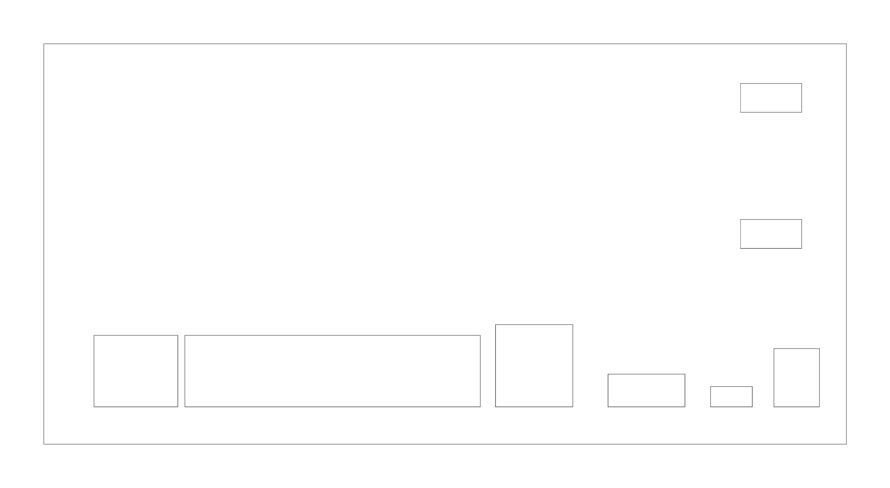
</a>
</figure>


In reality, the acrylic is too thick and some ports are too recessed to be usable. The HDMI port usually works, but requires firmly pushing the cable all the way in. The micro USB port isn't really usable, but I don't need it. All the other ports are fine.

# Weld acrylic

The downside of laser cutting is that it is only two dimensional: I had to find some way to attach rails for the hard drive bays.

I cut thin strips of acrylic for the hard drive rails. Using acrylic cement I glued the rails to the side panel. (Actually acrylic cement is not really a glue, it is a solvent for [solvent welding] acrylic. The bond can be very strong.) The acrylic cement I used is water thin, so I used capillary action to wick the solvent underneath the rails for welding.

I cut a second piece of acrylic for the bottom front panel below the two hard drive bays. The BPI-R2 has a front SD card slot I did not want to block, so I cut a slot in the front panel to allow access. I tried to dip the acrylic vertically in the solvent for welding, which worked but fogged up the material that was softened.

It's probably a good idea to do this step in a well ventilated area and wear appropriate gloves. The acrylic cement has a fairly scary SDS sheet. Also the stuff evaporates quickly at room temperature.

# Mount SBC

Mark all the screw locations on the bottom metal plate and drill them out using a drill press. Make sure the board is as far close to the front edge as possible so the SD card slot will be accessible.

Mount the board using whatever size of motherboard standoffs. I used some short M2 motherboard standoffs I think.

# Melt screw threads

At this point I had to figure out how to mount the acrylic panel on the side of the enclosure. Ideally, I could just reuse the original screws... but acrylic is very brittle, so tapping holes with a tap is unlikely to work. Instead I melted the threads into it!

First, mark all the original holes and drill them out to their full depth. Ensure these pilot holes are sufficiently large. Unlike with normal tapping, no material is going to be removed, just melted plastic pushed out of the way. Using a drill press and drilling very slowly is probably a good idea.

Then using the original screws, heat them up and screw them into the holes. I used pliers to hold the screw in a gas flame and then quickly screwed them in. If the screw gets stuck, stop and reheat it.

This may discolor the screws some, but you can rearrange them when done to hide them all on the bottom.

<figure>
<figcaption>Enclosure with acrylic and SBC mounted</figcaption>
<a href="images/nas-finished-acrylic.jpg">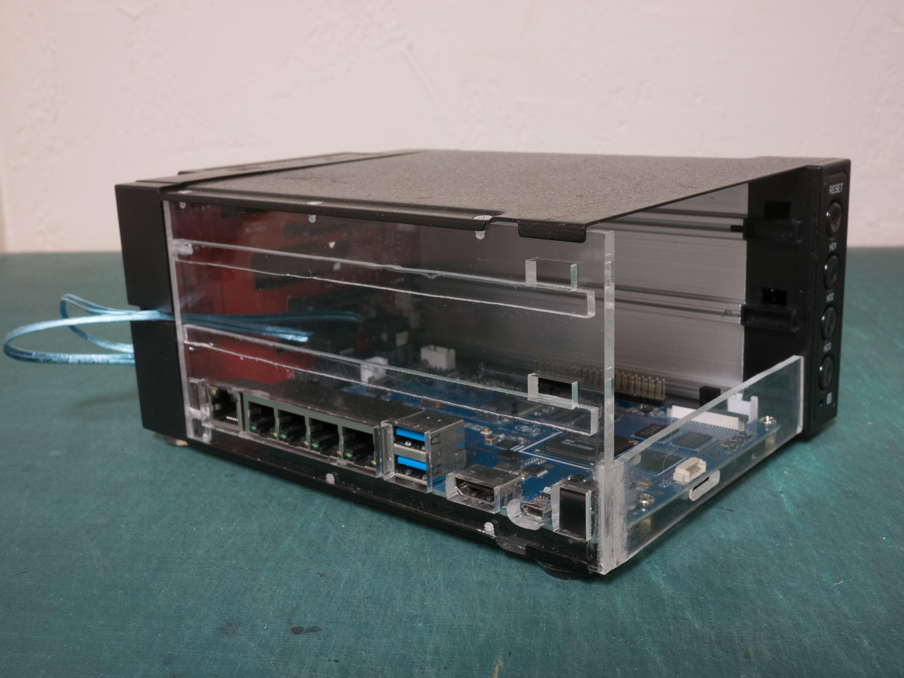</a>
</figure>

# Done!

Stick some adhesive rubber feet on the bottom and plug it in.

<figure>
<a href="images/nas-finished-leds.jpg">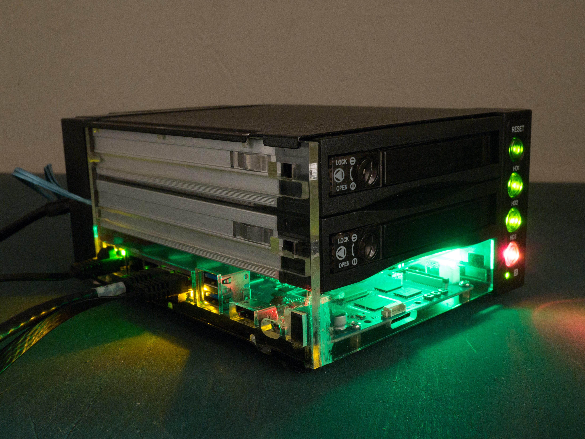</a>
</figure>

The finished product sits with the rest of my networking equipment under my TV:

<figure>
<a href="images/nas-tv.jpg">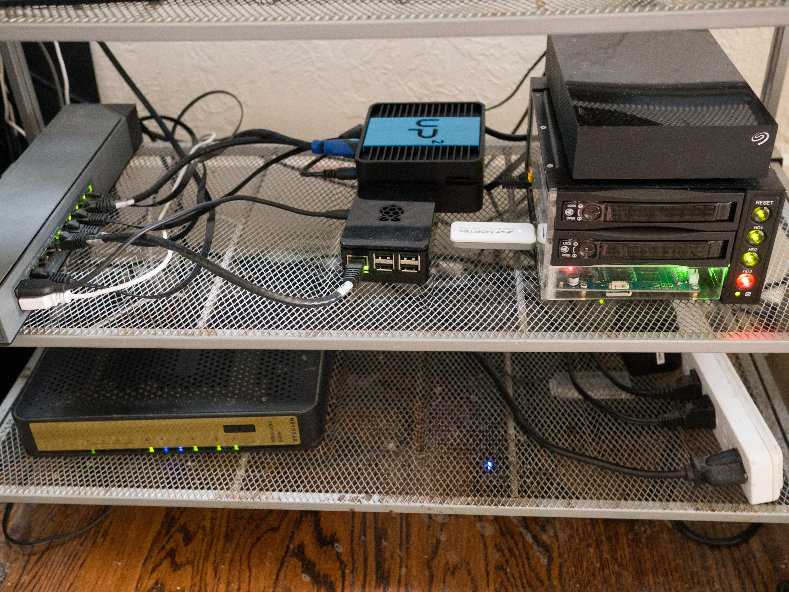</a>
</figure>

# Shuck hard drives

These instructions did not cover the hard drives themselves. I used some 8TB drives from shucked from inside Western Digital EasyStore external hard drives. Internally these drives contain a white labeled disk equivalent to a WD red.

The only quirk these drives have is that they require that the  3.3V line on pin 3 of the SATA power connector to actually follow the SATA spec. Active high on this pin is used to signal to the drive that it should power down. Some enclosures connect it to 3.3V permanently and the disks will not power up. In cheaper enclosures like the one I use, there is no 3.3V line at all and there is no problem.

There are a lot of details about EasyStores [on Reddit][datahoarder easystores] and some [photo instructions][datahoarder gallery] on removing the drives from the enclosures.

# Regrets

After completing this project, I have discovered a few things I'm unhappy with. Basically ARM boards only make so-so servers.

*   Only **2GB RAM.**
*   **Slow**. Even if it's quad core, 32-bit ARM isn't very fast.
*   **SATA bandwidth limited to ~300MB/sec** total. Some reason the total SATA bandwidth is not the full SATA3 speeds, even though it negotiates a 6.0GB/s link. I believe the ASM1061 SATA controller may be connected to the SOC by only a single PCIe 2.0 lane, reducing the speed significantly. [See details][SATA performance]. This isn't too much of a problem unless you use an SSD though, spinning disks are fairly slow.
*   **No ZFS.** I like ZFS a lot for a NAS, but it isn't very usable on a low RAM 32-bit ARM board. I actually compiled it, but I only get 60 MB/sec write speeds to a ZFS mirrored pool. And depending on who you listen to, running ZFS without ECC is a terrible idea.
*   **No RTC.** I'm going to attempt to connect a cheap DS3231 "Raspberry Pi RTC" someday.
*   **No mainline Linux.** The MediaTek MT7623N is slowly creeping towards mainline Linux, but it's not there yet.
*   **No HNAT.** This MediaTek SOC supports "HNAT" which should allow doing simple network switching and NAT at gigabit line speeds. But it involves a bunch of out-of-tree Linux patches, and doesn't work on current kernels.
*   **Terrible Wi-Fi chip.** The BPI-R2 does include a 2.4 GHz Wi-Fi/Bluetooth chip, but it's not very good. It requires out-of-tree patches _and_ binary blobs. And really weird runtime configuration to provide the firmware. I should be able to add a reasonable Wi-Fi card in the Mini PCIe slot though

# Conclusion

Overall I consider the project a success. I haven't found any other projects online building a computer inside of a hot-swap enclosure and I think that worked well. The BPI-R2 is still plenty capable if I limit the server to only NAS tasks. I am very happy with the professional finish of the project. And learning about acrylic welding was fun.

[SATA performance]: http://forum.banana-pi.org/t/sata-performance-max-disk-size/3828/16
[backplane]: https://www.newegg.com/Product/Product.aspx?Item=N82E16817995004
[thin sata cables]: https://www.amazon.com/gp/product/B01IBA31OM
[SATA power splitter]: https://www.amazon.com/gp/product/B0086OGN9E
[bpi-r2]: http://www.banana-pi.org/r2.html
[power pins issue]: https://github.com/frank-w/BPI-R2-4.14/issues/35
[power pins forum]: http://forum.banana-pi.org/t/bpi-r2-boot-power-suppy/3647
[battery connector]: http://forum.banana-pi.org/t/battery-cable-circuit/3737/9
[datahoarder easystores]: https://www.reddit.com/r/DataHoarder/comments/7fx0i0/wd_easystore_8tb_compendium/
[datahoarder gallery]: https://imgur.com/gallery/IsZxx
[solvent welding]: https://en.wikipedia.org/wiki/Plastic_welding#Solvent_welding

<div id="disqus_thread"></div>
<script>
var disqus_config = function () {
this.page.url = "https://bburky.com/NAS/";  // Replace PAGE_URL with your page's canonical URL variable
this.page.identifier = "NAS"; // Replace PAGE_IDENTIFIER with your page's unique identifier variable
};
(function() { // DON'T EDIT BELOW THIS LINE
var d = document, s = d.createElement('script');
s.src = 'https://bburky-com.disqus.com/embed.js';
s.setAttribute('data-timestamp', +new Date());
(d.head || d.body).appendChild(s);
})();
</script>
<noscript>Please enable JavaScript to view the <a href="https://disqus.com/?ref_noscript">comments powered by Disqus.</a></noscript>
